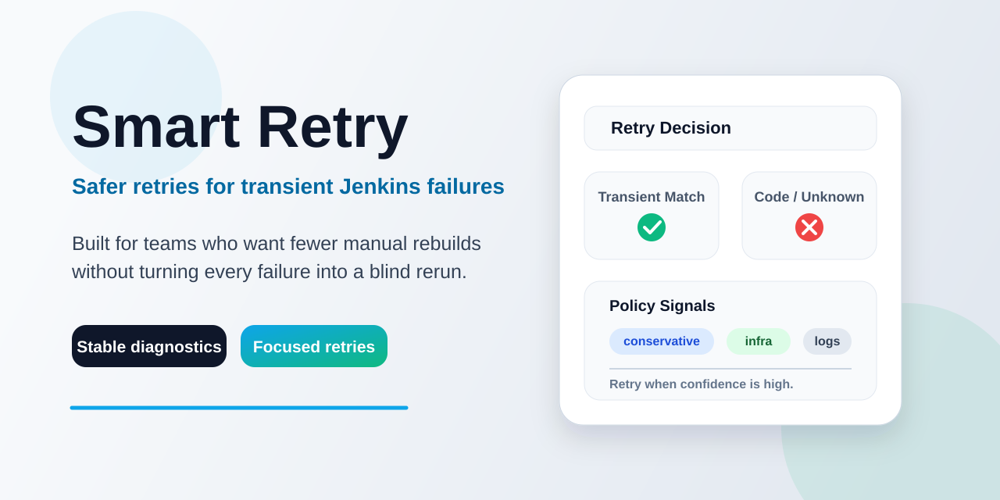

# Smart Retry

> Safer retries for transient Jenkins failures.

`smartRetry` helps Jenkins avoid blind retries by retrying high-confidence transient failures and failing fast on deterministic errors.

Good fit for:

- lost agents or evicted Kubernetes pods
- temporary Git / SCM failures
- short-lived network or artifact repository outages

Fails fast on:

- compilation failures
- Pipeline logic errors
- stable test failures
- unknown failures without a high-confidence match

## When To Use It

Smart Retry works best around idempotent CI steps such as:

- checkout and dependency download
- build and test stages affected by flaky infrastructure
- container/image pulls
- calls to external services that sometimes fail transiently

It is not meant to be a blanket replacement for every retry in every pipeline.

Avoid wrapping steps that are not safe to run again unless you are confident they are idempotent.

## Install

Install the plugin in Jenkins, then restart Jenkins if your controller asks for it.

After installation:

1. Open `Manage Jenkins` -> `System`.
2. Find the `Smart Retry` section.
3. Choose a default profile and shared retry defaults.
4. Save the configuration.

## Jenkins Configuration

The plugin supports Jenkins global configuration for:

- default profile selection
- shared retry defaults
- named custom profiles
- constrained custom classification rules for narrow transient-only environment-specific regex matches
- built-in rule disabling by individual built-in retry rule id
- bounded console-log context depth used during classification

Note: some steps, especially `sh`, often put the most useful error text only in console output. Smart Retry can use a bounded, attempt-scoped fragment of the build log as additional classification context.

## Choose A Profile

| Profile | Best for | Retries |
| --- | --- | --- |
| `conservative` | first rollout and lowest-risk adoption | `AGENT_LOST`, `SCM_TRANSIENT` |
| `infra` | cloud CI environments with broader external dependency volatility | `AGENT_LOST`, `SCM_TRANSIENT`, `NETWORK_TRANSIENT`, `ARTIFACT_REPO_TRANSIENT`, `IDENTITY_PROVIDER_TRANSIENT` |
| named custom profiles | team-specific policy choices defined by administrators | only the failure categories the custom profile allows |

Named custom profiles are defined in Jenkins global configuration and let teams opt into a controlled retry policy without changing the built-in classifier behavior.

Custom classification rules are also defined in Jenkins global configuration. They let administrators map narrow, environment-specific log patterns to one of the supported transient failure types without changing Pipeline DSL usage.

## Quick Start

Use the default conservative behavior:

```groovy
smartRetry {
  sh 'mvn -B test'
}
```

Use the broader `infra` profile when your CI environment is more dependent on external services:

```groovy
smartRetry(profile: 'infra', maxRetries: 2, backoff: 'exponential') {
  sh 'mvn -B test'
}
```

For most jobs, start with the default behavior and move to `infra` only when broader transient dependency or external-service failures are common.

Available step parameters:

- `profile`: selects which failure categories Smart Retry is allowed to retry; if unset, Jenkins uses the global Smart Retry default profile
- `maxRetries`: the number of additional attempts allowed after the initial failure
- `backoff`: retry delay strategy; current values are `fixed` and `exponential`
- `initialDelaySeconds`: base delay before the first retry; with `exponential`, later retries grow from this value

Leave an optional step field unset when you want Jenkins to use the global Smart Retry default instead of a per-step override.

You can also generate a starting `smartRetry` snippet from Jenkins `Pipeline Syntax` -> `Snippet Generator`.

## Common Examples

Retry only the narrowest infrastructure failures:

```groovy
smartRetry {
  git branch: 'main',
      credentialsId: 'scm-creds',
      url: 'https://gitlab.example.com/your-group/your-repo.git'
}
```

Retry a build step with broader infra coverage:

```groovy
smartRetry(profile: 'infra', maxRetries: 2, backoff: 'fixed', initialDelaySeconds: 10) {
  sh 'mvn -B verify'
}
```

Use a team-specific custom profile defined by an administrator:

```groovy
smartRetry(profile: 'backend-ci') {
  sh 'mvn -B dependency:go-offline'
}
```

## Complete Pipeline Example

Declarative Pipeline:

```groovy
pipeline {
  agent any

  stages {
    stage('Checkout') {
      steps {
        smartRetry {
          git branch: 'main',
              credentialsId: 'scm-creds',
              url: 'https://gitlab.example.com/your-group/your-repo.git'
        }
      }
    }

    stage('Build') {
      steps {
        smartRetry(profile: 'infra', maxRetries: 2, backoff: 'fixed', initialDelaySeconds: 10) {
          sh 'mvn -B verify'
        }
      }
    }
  }
}
```

This is a good starting pattern:

- use `conservative` or the default profile around checkout-like steps
- use `infra` only where broader transient dependency failures are common
- keep the wrapped block as small and idempotent as practical

## What You See In Builds

Smart Retry is designed to stay explainable.

In the console log, it prints:

- the start of each attempt
- the classified failure category
- whether it will retry or stop
- the reason for that decision
- retry scheduling details
- a final success or final failure summary line

A short example looks like this:

```text
[smartRetry] begin attempt=1
[smartRetry] attempt=1 profile=infra classified=SCM_TRANSIENT decision=RETRY nextAttempt=2 delayMillis=10000
[smartRetry] begin attempt=2
[smartRetry] completed profile=infra result=SUCCESS attempts=2 retriesUsed=1 reason="Recovered after 1 scheduled retry"
```

Each build that uses `smartRetry` also gets a dedicated Smart Retry page that shows:

- the active profile
- attempt details when retries were needed
- why Smart Retry retried or stopped
- the final outcome, including success without retry, success after retry, or final failure

## Troubleshooting

If Smart Retry did not retry when you expected:

- check the console log for the classified failure category and final reason
- confirm the selected profile allows that category
- note that the console log uses internal `FailureType` names such as `SCM_TRANSIENT` and `UNKNOWN`
- confirm the failure text is present in the exception or recent console output

If Smart Retry retried too broadly:

- switch from `infra` to `conservative`
- narrow behavior with a named custom profile
- disable an individual built-in retry rule in global configuration

## FAQ

### 1. Does Smart Retry replace Jenkins `retry {}`?

Not exactly. The two steps solve different problems.

Jenkins `retry {}` is unconditional: if the wrapped block fails, Jenkins reruns it without asking why it failed.

Jenkins `retry(count: ..., conditions: [...])` is narrower than plain `retry {}` and already covers some important infrastructure cases, especially agent/pod loss and other resumability-related failures handled by Jenkins core and companion plugins.

Smart Retry is failure-aware: it first classifies the failure, then retries only when the active profile allows that failure category.

In practice:

- use `retry {}` when you already know a step is safe to rerun blindly
- use `retry(count: ..., conditions: [...])` when Jenkins' built-in retry conditions already match the infrastructure failure mode you care about
- use `smartRetry {}` when you want safer defaults and do not want compilation failures, test failures, or Pipeline logic errors retried automatically
- use `smartRetry {}` when you also want profile-driven policy, richer transient failure categories such as SCM or artifact/network outages, centralized defaults, and build-user-visible retry reasoning

Example:

```groovy
retry(2) {
  sh 'mvn -B test'
}
```

This retries on any failure, including deterministic ones.

```groovy
retry(count: 2, conditions: [agent()]) {
  node('linux') {
    sh 'mvn -B test'
  }
}
```

This retries the agent-bound block only for Jenkins-recognized agent-related failure conditions.

```groovy
smartRetry(profile: 'infra', maxRetries: 2) {
  sh 'mvn -B test'
}
```

This retries only when the failure matches a high-confidence transient category that the selected profile allows, including categories such as `SCM_TRANSIENT`, `NETWORK_TRANSIENT`, or `ARTIFACT_REPO_TRANSIENT` when the active profile permits them.

### 2. Should I wrap an entire pipeline stage?

Usually no. `smartRetry` applies only to the block you wrap, and in most cases it is better to wrap the smallest practical idempotent block that is most exposed to transient infrastructure failures.

### 3. Why was a failure not retried?

The most common reasons are:

- the failure was classified as a non-retryable failure category
- the selected profile does not allow retries for that category
- retry attempts were already exhausted
- the failure did not match a high-confidence rule and stayed `UNKNOWN` in the console output

### 4. Can I tune behavior for different teams?

Yes. Administrators can define named custom profiles in Jenkins global configuration and let teams opt into them from their Jenkinsfiles.

## Learn More

- [MVP PRD](./docs/mvp-prd.md)
- [Development Plan](./docs/development-plan.md)
- [Implementation Plan](./docs/implementation-plan.md)

## Contributing

Refer to the Jenkins project [contribution guidelines](https://github.com/jenkinsci/.github/blob/master/CONTRIBUTING.md).

## License

Licensed under MIT, see [LICENSE.md](./LICENSE.md).
